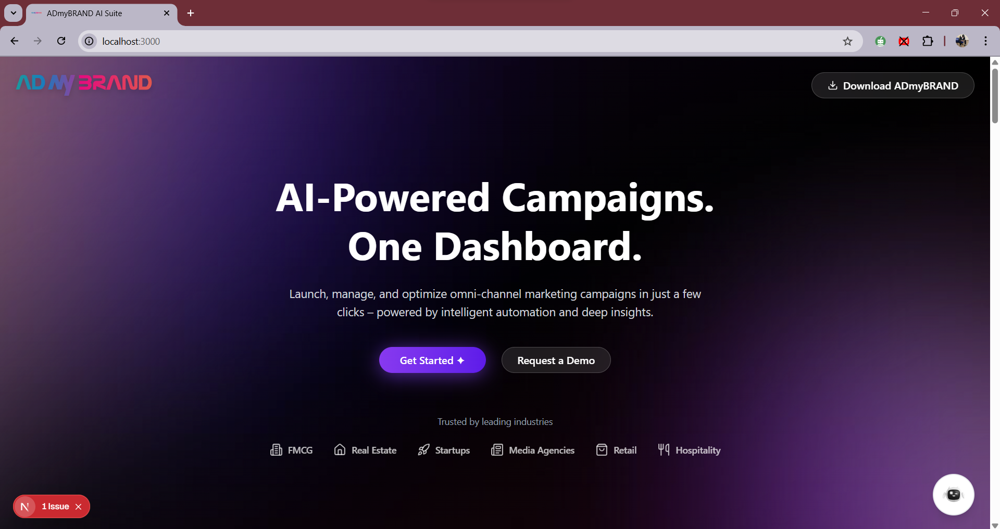

# ADmyBRAND AI Suite - Modern SaaS Landing Page

A production-ready SaaS landing page built with Next.js 14, TypeScript, and modern web technologies. Features AI integration, interactive components, and responsive design.

[](https://nextjs.org/)
[](https://www.typescriptlang.org/)
[](https://tailwindcss.com/)
[](https://www.framer.com/motion/)



*ADmyBRAND AI Suite - Modern SaaS landing page with AI-powered campaign management dashboard*

## Live Demo

**[ADmyBrand-AI Suite](https://admybrand-ai-suite-delta.vercel.app/)**

## Features

### Core Sections
- **Hero Section** - Compelling headline with CTA and hero image
- **Features Section** - 9 features with interactive cards and animations
- **Pricing Section** - 3 pricing tiers with interactive calculator
- **Testimonials** - Customer reviews with animated carousel
- **FAQ Section** - Collapsible questions with smooth animations
- **Blog Section** - Featured articles and resources
- **Footer** - Comprehensive links and newsletter signup

### Technical Features
- **Next.js 14** with App Router and TypeScript
- **Component Library** - 8+ reusable components
- **Modern Styling** - Tailwind CSS with custom design system
- **Advanced Animations** - Framer Motion + GSAP
- **AI Integration** - Functional chatbot with Gemini API
- **Form Handling** - Demo request modal with validation
- **Performance Optimized** - Image optimization and lazy loading
- **Mobile-First Responsive** - Flawless across all devices

### Interactive Features
- **Pricing Calculator** - Real-time calculation with sliders
- **AI Chatbot** - Context-aware responses with quick actions
- **Demo Video Download** - Direct video download functionality
- **Smooth Animations** - Scroll-triggered and hover effects

## Tech Stack

- **Framework:** Next.js 14 (App Router)
- **Language:** TypeScript
- **Styling:** Tailwind CSS 4.0
- **Animations:** Framer Motion + GSAP
- **Icons:** Lucide React
- **AI:** Google Gemini API
- **Deployment:** Vercel

## Quick Start

1. **Clone the repository**
```bash
git clone https://github.com/yourusername/admybrand-landing.git
cd admybrand-landing
```

2. **Install dependencies**
```bash
npm install
```

3. **Set up environment variables**
```bash
# Create .env.local file
cp .env.example .env.local

# Add API key (optional)
GOOGLE_GEMINI_API_KEY=your_api_key_here
```

4. **Run development server**
```bash
npm run dev
```

5. **Open browser**
Navigate to [http://localhost:3000](http://localhost:3000)

## Project Structure

```
admybrand-landing/
├── app/                    # Next.js App Router
│   ├── api/               # API routes
│   │   ├── chat/          # AI chatbot API
│   │   └── demo-request/  # Demo request API
│   ├── globals.css        # Global styles
│   ├── layout.tsx         # Root layout
│   └── page.tsx           # Home page
├── components/            # React components
│   ├── ui/               # Reusable UI components
│   │   ├── button.tsx
│   │   ├── input.tsx
│   │   ├── accordion.tsx
│   │   ├── card-hover-effect.tsx
│   │   ├── floating-navbar.tsx
│   │   ├── chatbot-bubble.tsx
│   │   ├── demo-request-modal.tsx
│   │   └── animated-testimonials.tsx
│   ├── Features.tsx      # Features section
│   ├── Pricing.tsx       # Pricing section
│   ├── Testimonials.tsx  # Testimonials section
│   ├── FAQ.tsx          # FAQ section
│   ├── Blog.tsx         # Blog section
│   ├── Footer.tsx       # Footer component
│   └── hero-section-demo-1.tsx
├── lib/                  # Utility functions
├── public/              # Static assets
└── package.json
```

## Component Library

### Core Components
- **Button** - Reusable button with variants
- **Input** - Form input with validation
- **Accordion** - Collapsible content sections
- **Card** - Hover effect cards with glassmorphism
- **FloatingNav** - Sticky navigation with animations
- **ChatbotBubble** - AI assistant with quick actions
- **DemoRequestModal** - Modal for demo requests
- **AnimatedTestimonials** - Carousel with transitions

### Features
- TypeScript support with full type safety
- Responsive design with mobile-first approach
- Accessibility with ARIA labels and keyboard navigation
- Performance optimized with lazy loading
- Easy customization with design tokens

## Deployment

### Deploy to Vercel (Recommended)

1. **Push to GitHub**
```bash
git add .
git commit -m "Initial commit"
git push origin main
```

2. **Deploy to Vercel**
- Go to [vercel.com](https://vercel.com)
- Import your GitHub repository
- Vercel will automatically detect Next.js and deploy

3. **Environment Variables**
- Add API keys in Vercel dashboard
- Set `GOOGLE_GEMINI_API_KEY` for chatbot functionality

### Alternative Deployment
- **Netlify**: Build and drag `.next` folder
- **Railway**: Use Railway CLI for deployment

## Key Features

### Interactive Pricing Calculator
- Real-time price calculation based on usage
- Slider controls for ad spaces, campaigns, team members
- Automatic plan recommendation with visual feedback

### AI Chatbot Integration
- Powered by Google Gemini API
- Context-aware responses about ADmyBRAND
- Quick action buttons for navigation
- Fallback responses for reliability

### Advanced Animations
- Framer Motion for component animations
- GSAP for complex timeline animations
- Scroll-triggered animations for engagement
- 3D hover effects on interactive elements

### Responsive Design
- Mobile-first approach
- Breakpoint-specific layouts
- Touch-friendly interactions
- Optimized for all screen sizes

## Customization

### Colors and Branding
Modify the color palette in `tailwind.config.js`:

```javascript
colors: {
  primary: {
    50: '#f5f3ff',
    500: '#8f4aff',
    600: '#7c3aed',
  },
  secondary: {
    500: '#f5bfa0',
  }
}
```

### Content Updates
- **Hero Section**: `components/hero-section-demo-1.tsx`
- **Features**: `components/ui/card-hover-effect.tsx`
- **Pricing**: `components/pricing.tsx`
- **Testimonials**: `components/ui/animated-testimonials.tsx`
- **FAQ**: `components/Faq.tsx`

## Browser Support

- Chrome (latest)
- Firefox (latest)
- Safari (latest)
- Edge (latest)
- Mobile browsers (iOS Safari, Chrome Mobile)

## Contributing

1. Fork the repository
2. Create a feature branch (`git checkout -b feature/amazing-feature`)
3. Commit your changes (`git commit -m 'Add amazing feature'`)
4. Push to the branch (`git push origin feature/amazing-feature`)
5. Open a Pull Request


## Acknowledgments

- Next.js Team for the framework
- Vercel for deployment platform
- Tailwind CSS for utility-first styling
- Framer Motion for animations
- Google Gemini for AI capabilities

---

**Developed by thevedantt**

*This project demonstrates modern web development with Next.js 14, TypeScript, and AI integration capabilities.*
